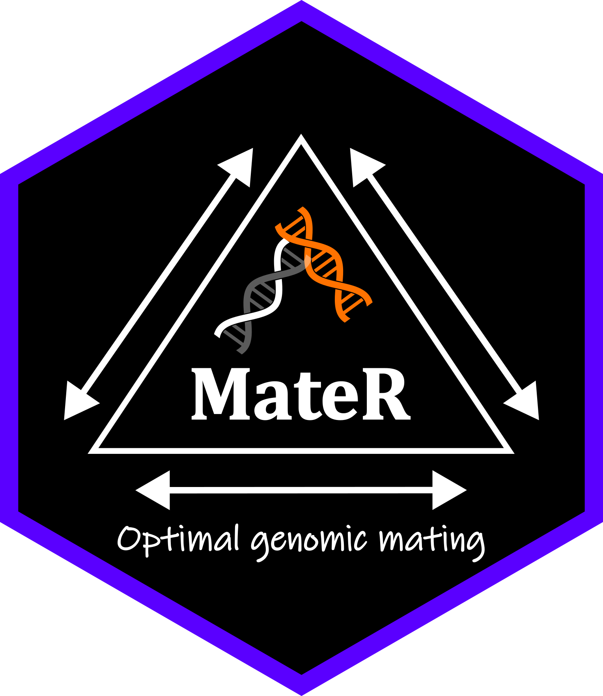

# MateR
 

Genomic Mating package. Optimize mating plans using genomic information to maximize genetic gain, within-family variance, and genetic diversity. Supports polyploids, multi-trait optimization, additive and dominance effects, directional dominance (inbreeding and heterosis), and testers.

Documentation and examples of MateR usage are available in the Vignette.

## Installation

Please, see Installation.txt for instructions on how to install MateR.

Make sure you have the TrainSel package installed. More details in https://github.com/TheRocinante-lab/TrainSel

## Citation: 

Fernandez-Gonzalez, J., Metwally, S. M., & Isidro y Sanchez, J. (2025). MateR: a novel framework for computing the usefulness criterion and applying genomic mating. bioRxiv, 2025-09.
